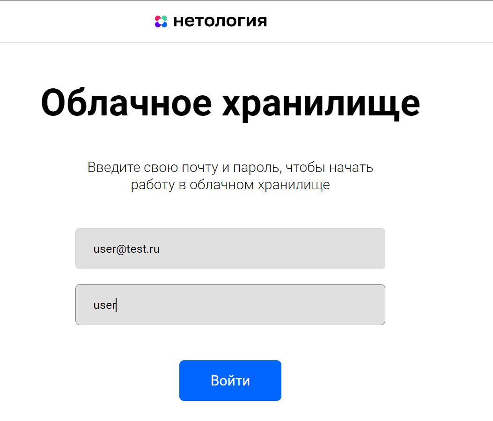
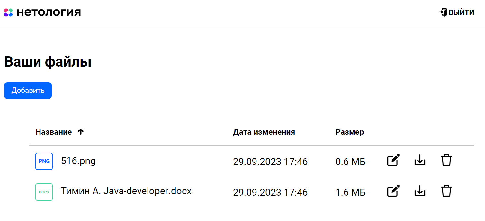

# Облачное хранилище

## Задача

Данный проект является дипломной работой. С заданием можно
ознакомиться [здесь](https://github.com/netology-code/jd-homeworks/blob/master/diploma/cloudservice.md).

## Описание проекта

REST-сервис предоставляет интерфейс для интеграции с 
[FRONT](https://github.com/netology-code/jd-homeworks/tree/master/diploma/netology-diplom-frontend) 
для облачного хранения данных по заранее описанной [спецификации](CloudServiceSpecification.yaml).

Сервис предоставляет возможности:
- авторизации;

- вывода списка файлов;
- добавления файлов в хранилище;
- удаление файлов из хранилища;

Скриншоты работы приложения:





## Запуск приложения

Для запуска введите в терминале:

```
./mvn clean package -Dskiptests
docker-compose up -d --build
```
Docker-образы запустятся на портах:
- BACKEND: localhost:8081
- POSTGRESQL: localhost:5432


## Описание технической части проекта

- Приложение разработано с использованием Spring Boot;
- Использован сборщик пакетов Maven;
- Логирование Slf4j;
- При авторизации и безопасности используется JWT Token и Spring Security;
- База данных PostgreSQL;
- Миграции баз данных с помощью Liquibase;
- Для запуска используется docker, docker-compose;

## Описание архитектуры приложения

Архитектура приложения - многослойная (клиент-серверная), где процессы представления,
обработки и управления данными являются логически отделенными друг от друга процессами.

Модель многослойной архитектуры помогает создать гибкое и многократно используемое программное обеспечение.

## Эндпоинты

Авторизация:

* POST: `/login` - принимает объект user(login и password) возвращает auth-token, который используется в header
для идентификации пользователя на BACKEND для дальнейших запросов.
* POST: `/logout` - принимает объект auth-token в header и деактивирует его. 
Последующие запросы с этим токеном будут не авторизованы и вернут код 401. Необходимо быть авторизованным.

Управление файлами:

* POST: `/file` - принимает файл (multipart/form-data) и сохраняет его в БД. Необходимо быть авторизованным.
* DELETE: `/file` - принимает имя файла и устанавливает флаг isDelete в базе данных. 
Файл больше не виден пользователю.
* GET: `/file` - принимает имя файла и отправляет файл пользователю на загрузку. Необходимо быть авторизованным.
* PUT: `/file` - принимает имя файла которое следует заменить и новое имя файлу.
Производить переименование файла. Необходимо быть авторизованным.
* GET: `/list` - принимает лимит файлов для отображения.
Возвращает файлы для отображения принадлежащие данному пользователю. Необходимо быть авторизованным.

## Тестирование

Код покрыт unit тестами с использованием mockito.

Для интеграционных тестов использован test containers.

Для мануального тестирования доступны пользователи:
- User: 
  - login: user@test.ru
  - password: user
- Admin:
  - login: admin@test.ru
  - password: admin